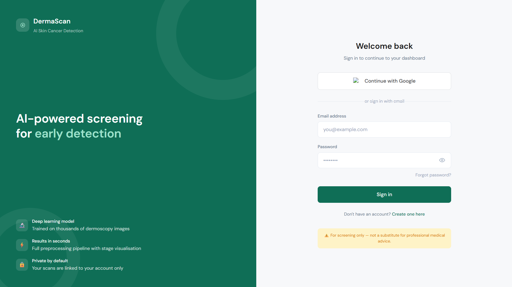

# 🩺 Skin Cancer Detection and Classification Using Deep Learning

An AI-powered web-based system for skin lesion segmentation and disease classification using a hybrid deep learning pipeline. The system first uses **U-Net** to segment the lesion region and then uses a hybrid **EfficientNetV2-S + Vision Transformer (ViT)** architecture to classify the skin lesion.

> **Disclaimer:** This project is developed for academic and research purposes. It is an assistive tool and is not a replacement for professional medical diagnosis.

## 📌 Project Overview

Skin cancer detection from dermoscopic images is challenging because images may contain background noise, hair, illumination variations, and poorly defined lesion boundaries.

This project addresses these challenges using a two-stage deep learning pipeline:

```text
Input Skin Image
       │
       ▼
Image Preprocessing
       │
       ▼
     U-Net
  Segmentation
       │
       ▼
Predicted Lesion Mask
       │
       ▼
Lesion / ROI
       │
       ▼
EfficientNetV2-S + ViT
       │
       ▼
Disease Classification
       │
       ▼
Prediction + Confidence
```

## 🎯 Objectives

- Automatically segment skin lesions from dermoscopic images.
- Reduce the effect of irrelevant background regions.
- Extract meaningful visual features from lesion regions.
- Capture both local and global image information.
- Classify skin lesions into their respective disease categories.
- Provide a web interface for image upload and prediction.
- Maintain prediction/scan history.
- Generate prediction reports.

## 🧠 Proposed Methodology

### 1. Image Preprocessing

Input images are processed before being passed to the deep learning models.

Main operations include:

- Image resizing
- RGB conversion
- Pixel normalization
- Data augmentation during training
- Image/mask alignment

Images are resized to **128 × 128 pixels** and normalized to the range **0–1**.

### 2. Lesion Segmentation — U-Net

A U-Net model is used to identify the lesion region.

HSV/HSL-based image processing was used to generate initial pseudo-ground-truth masks for U-Net training. The trained U-Net subsequently generates lesion masks automatically.

```text
Input Image
     │
     ▼
  Encoder
     │
     ▼
 Bottleneck
     │
     ▼
  Decoder
     │
     ▼
Predicted Mask
```

### 3. ROI / Lesion Extraction

The predicted U-Net mask is used to isolate the lesion region and reduce irrelevant background information.

### 4. Feature Extraction — EfficientNetV2-S

EfficientNetV2-S is used as the CNN component for extracting hierarchical visual features such as texture, color patterns, lesion boundaries, and local spatial structures.

### 5. Global Feature Learning — Vision Transformer

Vision Transformer (ViT) is used to capture global relationships and long-range dependencies within the lesion representation.

### 6. Classification

The extracted features are passed to the classification layer to produce the predicted lesion/disease category and confidence score.

## 📊 U-Net Segmentation Results

The trained U-Net achieved the following evaluation results during project development:

| Metric | Result |
|---|---:|
| Test Accuracy | **99.23%** |
| Dice Score | **94.40%** |
| IoU Score | **89.60%** |

These metrics evaluate the segmentation model's performance against the prepared target masks.

## 🏗️ System Architecture

```text
                    ┌──────────────────┐
                    │      User        │
                    └────────┬─────────┘
                             │
                             ▼
                    ┌──────────────────┐
                    │  Web Interface   │
                    │   Image Upload   │
                    └────────┬─────────┘
                             │
                             ▼
                    ┌──────────────────┐
                    │  Backend Server  │
                    └────────┬─────────┘
                             │
                             ▼
                  ┌──────────────────────┐
                  │ Image Preprocessing  │
                  └──────────┬───────────┘
                             │
                             ▼
                       ┌───────────┐
                       │   U-Net   │
                       └─────┬─────┘
                             │
                             ▼
                    Segmentation Mask
                             │
                             ▼
                         Lesion ROI
                             │
                             ▼
              ┌───────────────────────────┐
              │ EfficientNetV2-S + ViT    │
              └─────────────┬─────────────┘
                            │
                            ▼
                     Classification
                            │
                            ▼
                  Disease + Confidence
                            │
                            ▼
                    ┌──────────────┐
                    │   Dashboard  │
                    └──────────────┘
```

## 🖥️ Web Application

### Frontend

The frontend handles:

- User registration and login
- Image upload
- Image preview
- Prediction result display
- Segmentation result display
- Scan history
- Dashboard navigation
- PDF report generation

Technologies:

- HTML5
- CSS3
- JavaScript
- EJS
- jsPDF

### Backend

The backend handles:

- Authentication
- Image uploads
- Session management
- API communication
- Prediction requests
- Scan history
- Database operations

Technologies:

- Node.js
- Express.js
- Axios
- Multer
- Express Session
- bcrypt
- Connect-Mongo

### Machine Learning API

The Python ML service performs:

```text
Image
  ↓
Preprocessing
  ↓
U-Net Segmentation
  ↓
Lesion/ROI Extraction
  ↓
Classification
  ↓
Prediction
```

### Database

MongoDB is used for application data such as:

- User information
- Session information
- Prediction records
- Scan history

Mongoose is used for MongoDB interaction and schema management.

## 🛠️ Technologies Used

### Programming
- Python
- JavaScript

### Deep Learning
- TensorFlow
- Keras
- U-Net
- EfficientNetV2-S
- Vision Transformer (ViT)

### Machine Learning
- Scikit-learn

### Image Processing
- OpenCV
- NumPy

### Data Processing
- Pandas

### Visualization
- Matplotlib
- Seaborn

### Frontend
- HTML5
- CSS3
- JavaScript
- EJS
- jsPDF

### Backend
- Node.js
- Express.js
- Axios
- Multer
- bcrypt
- Express Session
- Connect-Mongo

### Database
- MongoDB
- Mongoose

### Development / Training
- Kaggle Notebook
- Jupyter Notebook
- Visual Studio Code

## 📊 Dataset

The project uses dermoscopic skin lesion images based on the **HAM10000 dataset** and the project's prepared dataset.

The prepared dataset contains approximately:

```text
20,000 original images
20,000 corresponding masks
```

The masks were initially generated using HSV/HSL-based image processing and were used as target masks for U-Net training.

> The full dataset should not be committed to GitHub because of its size and licensing/distribution considerations. Provide dataset acquisition instructions instead.

## 📁 Project Structure

A simplified repository structure is:

```text
Skin-Cancer-Detection/
│
├── frontend/
│   ├── views/
│   ├── public/
│   └── ...
│
├── backend/
│   ├── routes/
│   ├── models/
│   ├── controllers/
│   └── server.js
│
├── ml/
│   ├── unet/
│   │   └── unet_model.keras
│   │
│   ├── classifier/
│   │   ├── classifier_model.keras
│   │   └── label_encoder.pkl
│   │
│   ├── preprocessing/
│   └── app.py
│
├── screenshots/
│
├── requirements.txt
├── package.json
├── .gitignore
└── README.md
```

> Adjust this structure to match the final folders in your repository.

## ⚙️ Installation

### 1. Clone the Repository

```bash
git clone https://github.com/YOUR_USERNAME/skin-cancer-detection.git
cd skin-cancer-detection
```

### 2. Create Python Environment

```bash
python -m venv venv
```

Windows:

```bash
venv\\Scripts\\activate
```

Linux/macOS:

```bash
source venv/bin/activate
```

### 3. Install Python Dependencies

```bash
pip install -r requirements.txt
```

Typical dependencies include:

```text
tensorflow
numpy
pandas
opencv-python
scikit-learn
matplotlib
seaborn
flask
```

### 4. Install Node.js Dependencies

```bash
npm install
```

## 🔐 Environment Variables

Create a `.env` file in the appropriate backend directory.

Example:

```env
MONGODB_URI=your_mongodb_connection_string
SESSION_SECRET=your_session_secret
ML_API_URL=http://localhost:5000
PORT=3000
```

**Never commit `.env` or secret credentials to GitHub.**

Add the following to `.gitignore`:

```text
.env
venv/
__pycache__/
*.pyc
node_modules/
```

## 🚀 Running the Application

### Start the Machine Learning API

```bash
python app.py
```

### Start the Node.js Backend

```bash
npm start
```

Then open the local application URL configured by the backend.

## 🔬 Model Training

### U-Net Training

The U-Net segmentation pipeline follows:

```text
Training Image + Target Mask
          │
          ▼
     Preprocessing
          │
          ▼
        U-Net
          │
          ▼
   Predicted Mask
          │
          ▼
    Dice / IoU Evaluation
```

The trained U-Net model can be saved as:

```text
unet_model.keras
```

or:

```text
unet_model.h5
```

### Classification Training

The classification pipeline follows:

```text
Input Image
     +
U-Net Segmentation
     │
     ▼
Lesion / ROI
     │
     ▼
EfficientNetV2-S
     │
     ▼
Vision Transformer
     │
     ▼
Classification Head
     │
     ▼
Disease Prediction
```

## 📈 Evaluation Metrics

### Segmentation

- Accuracy
- Dice Coefficient
- Intersection over Union (IoU)

### Classification

- Accuracy
- Precision
- Recall
- F1-score
- Confusion Matrix

## 🧪 Application Workflow

1. User opens the web application.
2. User logs in.
3. User uploads a dermoscopic skin image.
4. Backend receives the image.
5. Image preprocessing is performed.
6. U-Net generates the lesion segmentation mask.
7. Lesion/ROI is extracted.
8. EfficientNetV2-S extracts visual features.
9. Vision Transformer captures global dependencies.
10. Classification model predicts the lesion category.
11. Confidence score is calculated.
12. Result is displayed on the dashboard.
13. Prediction information can be stored in scan history.
14. A report can be generated.

## 📷 Screenshots

Add application screenshots to the `screenshots/` directory and update the paths below.

### Login



### Dashboard


### Image Upload


### Lesion Segmentation


### Prediction Result


## 🔒 Security

The application uses:

- bcrypt for password hashing
- Session-based authentication
- MongoDB-backed session storage
- Environment variables for secrets
- Separation of frontend, backend, and ML services

Do not commit:

- Passwords
- API keys
- Database credentials
- Session secrets
- `.env` files

## ⚠️ Medical Disclaimer

This project is intended **only for academic and research purposes**.

It is designed as an assistive diagnostic system and **must not be used as a substitute for professional medical diagnosis**.

Predictions should not be used as the sole basis for treatment or medical decisions. A qualified healthcare professional should evaluate any suspected skin lesion.

## 🔮 Future Scope

- Training with larger and more diverse datasets
- Improved lesion annotations
- Further hyperparameter optimization
- Advanced transformer architectures
- Explainable AI using Grad-CAM and attention visualization
- Mobile application deployment
- Cloud deployment
- Clinical validation
- Improved inference speed
- Integration with additional dermatological datasets

## 👨‍💻 Project Team

**Skin Cancer Detection and Classification using Deep Learning**

**Department of Information Technology**

**Vidya Pratishthan's Kamalnayan Bajaj Institute of Engineering and Technology (VPKBIET), Baramati**

## ⭐ Project Highlights

```text
✓ U-Net based lesion segmentation
✓ HSV/HSL-based pseudo-mask generation
✓ EfficientNetV2-S feature extraction
✓ Vision Transformer global feature learning
✓ Deep learning-based lesion classification
✓ Web-based interface
✓ Node.js + Express backend
✓ Python ML API
✓ MongoDB database
✓ Scan/prediction history
✓ PDF report generation
```

## 📚 References

The project is based on research and resources related to:

- HAM10000 dermoscopic skin lesion dataset
- Deep learning-based skin lesion segmentation
- CNN-based skin lesion classification
- Vision Transformer architectures
- TensorFlow/Keras
- OpenCV
- Scikit-learn
